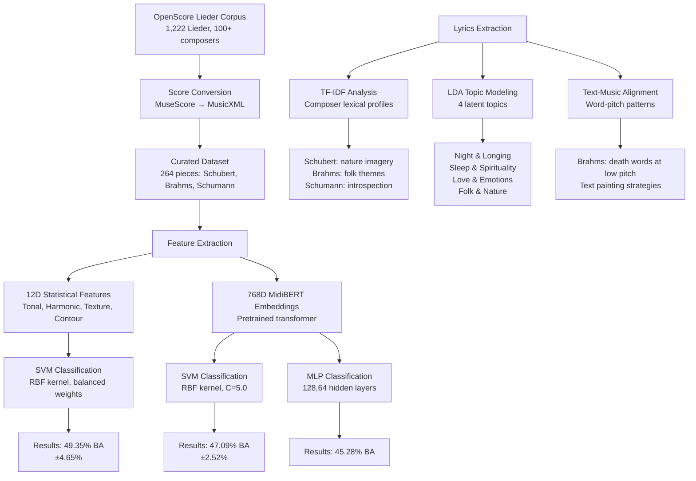

# Who Wrote this Lied? A Computational Approach to Lied Classification and Composer Fingerprinting

## Abstract

This project investigates whether individual composer style can be captured through computational analysis of symbolic music representations. We propose a four-layer feature framework combining **tonal tension** (Spiral Array Model), **harmonic complexity** (pitch class entropy), **pianistic texture** (onset density) and **melodic contour** (voice interval variation) to classify Lieder by Franz Schubert, Robert Schumann, and Johannes Brahms. Our experiments demonstrate that statistical descriptors from musicologically driven features achieve approximately 49.3% balanced accuracy using a Support Vector Machine classifier. This significantly outperforms both SVM (47.1%) and MLP (45.3%) classifiers on 768-dimensional pretrained transformer embeddings from Adversarial-MidiBERT on our 264-piece corpus.


---

## Dataset

| Composer | Number of Lieder | Percentage |
|----------|------------------|------------|
| Franz Schubert | 84 | 31.8% |
| Johannes Brahms | 109 | 41.3% |
| Robert Schumann | 71 | 26.9% |
| **Total** | **264** | **100%** |

**Data Sources:**
- [OpenScore Lieder Repository](https://github.com/OpenScore/Lieder)
- Scores converted from MuseScore (.mscx) to MusicXML (.mxl)

**Files:**
- [`dataset/metadata.csv`](dataset/metadata.csv) - Piece metadata (composer, title, lyricist, etc.)
- [`dataset/*.mxl`](dataset/) - MusicXML scores
- [`dataset/features_statistical.csv`](dataset/features_statistical.csv) - Pre-extracted 12D statistical features
- [`dataset/features_sequential.csv`](dataset/features_sequential.csv) - Sequential features

---

## Exploratory Data Analysis

### Musical Properties Distribution

Analysis of the corpus reveals composer-specific patterns in musical structure:

- **Time Signatures:** Schubert favors 2/4, Brahms & Schumann prefer 4/4; 3/4 appears as secondary meter for Schubert and Brahms, 2/2 for Schumann
- **Piece Length:** Brahms and Schumann tend toward compact forms (25-50 bars), while Schubert shows greater variance (up to ~175 bars), consistent with extended ballad form
- **Vocal Range:** All three composers use approximately the same vocal range

### Text Analysis

#### TF-IDF Characteristic Words

| Composer | Top Words (TF-IDF) |
|----------|-------------------|
| Franz Schubert | bächlein, gern, grün, haus, herz, nacht |
| Johannes Brahms | brust, herz, kind, komm, lieb, liebe |
| Robert Schumann | blumen, herz, himmel, traum, mutter |

#### LDA Topic Modeling (4 Latent Topics)

| Topic Label | Top Words |
|-------------|-----------|
| Night & Longing | komm, nacht, wohl, traum |
| Sleep & Spirituality | herz, wohl, nacht, schlaf, maria |
| Love & Emotions | liebe, wald, brust, tränen, mehr |
| Folk & Nature | gern, grün, liebst, schatz, leben |

**Topic Distribution by Composer:**

| Composer | Night & Longing | Sleep & Spirit. | Love & Emotions | Folk & Nature |
|----------|-----------------|-----------------|-----------------|---------------|
| Schubert | 21% | **31%** | 26% | 22% |
| Brahms | 30% | **36%** | 25% | 8% |
| Schumann | 25% | 25% | **34%** | 15% |

### Text-Music Alignment Analysis

Word-pitch alignment reveals composer-specific text painting strategies:

| Composer | High Pitch Words | Low Pitch Words |
|----------|------------------|-----------------|
| Schubert | Herz (heart), Ruh (quietness), Maria | - |
| Brahms | Seele (soul), Himmel (sky), ach (exclamatory) | Tod (death), stirbt (dies), Mensch (human), Odem (breath) |
| Schumann | Weh (pain), Liebe (love), Ferne (distance) | - |

**Key Finding:** Brahms systematically places death-related vocabulary at low pitch registers, demonstrating distinctive text painting technique.

---

## Feature Sets

### 1. Statistical Features (12D)

Derived from the four-layer theoretical framework:

| Feature Category | Descriptors | Musicological Basis |
|-----------------|-------------|---------------------|
| **Tonal Tension** | `tt_mean`, `tt_std`, `tt_entropy` | Spiral Array Model - Euclidean distance from tonal center |
| **Harmonic Complexity** | `hc_mean`, `hc_std`, `hc_entropy` | Pitch class distribution Shannon entropy |
| **Melodic Contour** | `mc_mean`, `mc_std`, `mc_entropy` | Interval succession statistics (categorical encoding) |
| **Pianistic Texture** | `pt_mean`, `pt_std`, `pt_entropy` | Note onset density per eighth-note position |


### 2. MidiBERT Embeddings (768D)

Pre-trained transformer representations extracted using [Adversarial-MidiBERT](https://github.com/RS2002/Adversarial-MidiBERT).

---

## Installation

### Requirements

```
Python 3.8+
music21>=8.0
pandas>=1.5
numpy>=1.21
scikit-learn>=1.0
scipy>=1.7
matplotlib>=3.5
seaborn>=0.11
torch>=1.9
transformers>=4.0
```

### Install Dependencies

```bash
pip install music21 pandas numpy scikit-learn scipy matplotlib seaborn
pip install torch transformers
```

---

## Usage

### Feature Extraction


**Extract MidiBERT Embeddings:**
```bash
# Requires Adversarial-MidiBERT setup
cd Adversarial-MidiBERT
python get_feature.py
```

### Classification Experiments

**Statistical Features (12D) with SVM:**
```bash
python scripts/12.py
```

**MidiBERT Embeddings (768D) with SVM:**
```bash
python scripts/768classificationmean.py
```

**MidiBERT Embeddings (768D) with MLP:**
```bash
python scripts/mlptraining.py
```

### Analysis

**ANOVA Discriminability Analysis:**
```bash
python scripts/anova_12.py
```

**Feature Importance & Selection:**
```bash
python scripts/see_importance.py
```

**Data Preprocessing:**
```bash
python scripts/clean_data.py
```

**Feature Merging:**
```bash
python scripts/conbine_features.py
```

---

## Results

### Classification Performance (Balanced Accuracy)

| Feature Set | Dimensions | Classifier | Balanced Accuracy | Std Dev |
|-------------|------------|------------|-------------------|---------|
| Statistical (12D) | 12 | SVM (RBF, balanced) | **49.35%** | 4.65% |
| MidiBERT (768D) | 768 | SVM (RBF, C=5.0) | 47.09% | 2.52% |
| MidiBERT (768D) | 768 | MLP (128,64, α=0.01) | 45.28% | - |

### Baseline Validation (BMP Dataset)

Validation on music21 BMP corpus (Palestrina, Monteverdi, Bach - distinct historical periods):

| Feature Set | Dimensions | Classifier | Balanced Accuracy | Std Dev |
|-------------|------------|------------|-------------------|---------|
| MidiBERT (768D) | 768 | SVM | **98.96%** | 1.40% |

### Per-Class F1-Scores

| Configuration | Schubert | Brahms | Schumann |
|---------------|----------|--------|----------|
| SVM + 12D | 0.36 | **0.61** | 0.50 |
| SVM + MidiBERT | 0.39 | 0.55 | 0.47 |
| MLP + MidiBERT | 0.31 | 0.52 | 0.47 |

### Key Findings

1. **Handcrafted features outperform pretrained embeddings** on small datasets (~49.3% vs 47.1%)
2. **SVM outperforms MLP** on MidiBERT embeddings (47.1% vs 45.3%)
3. **Brahms is most consistently identified** (F1: 0.52-0.61) due to distinctive text-painting strategies
4. **Schubert is most difficult to classify** (F1: 0.31-0.39) due to stylistic overlap with contemporaries
5. **Domain-specific features** better capture stylistic nuances for specialized corpora than general-purpose models

---

## Project Structure

```
who_wrote_this_lied-main/
├── README.md                    # This file
├── paper.pdf                    # Research paper
├── paper/
│   ├── main.tex                 # LaTeX source
│   └── references.bib           # Bibliography
├── dataset/
│   ├── metadata.csv             # Piece metadata
│   ├── features_statistical.csv # 12D features
│   ├── features_sequential.csv  # Sequential features
│   └── *.mxl                    # MusicXML scores (264 pieces)
├── midi_files/
│   └── *.mid                    # Converted MIDI files
├── scripts/
│   ├── 12.py                    # 12D feature classification (SVM)
│   ├── 30.py                    # 30D feature classification
│   ├── 768classificationmean.py # MidiBERT classification (SVM)
│   ├── mlptraining.py           # MLP classification
│   ├── anova_12.py              # ANOVA discriminability analysis
│   ├── see_importance.py        # Feature importance analysis
│   ├── clean_data.py            # Data preprocessing
│   └── conbine_features.py      # Feature merging
├── result/
│   ├── results_12.txt           # 12D SVM results
│   ├── results_768.txt          # 768D SVM results
│   ├── results_768-3.txt        # 768D SVM results (BMP dataset)
│   ├── 768_mlp_results.txt      # MLP classification results
│   ├── midibert_svm_evaluation_results.txt
│   ├── confusion_matrix_svm.png
│   ├── confusion_matrix_midibert_svm.png
│   ├── confusion_matrix_midibert_svm_3.png
│   ├── feature_accuracy_curve_*.png
│   ├── feature_distribution_anova.png
│   └── feature_selection_results_*.json
└── musif_output/
    ├── error_files.csv
    ├── jsymbolic_defs.xml
    └── jsymbolic_values.xml
```

---

## Project Workflow




## Limitations

1. **Small Dataset Size:** Only 264 songs with class imbalance (Brahms: 109, Schubert: 84, Schumann: 71)
2. **Excluded Composers:** Clara Schumann excluded due to limited available works, simplifying the exploration of the broader art song tradition
3. **Limited Generalization:** Constrained time and resources limited model testing and validation against other same-era composers
4. **Stylistic Proximity:** The modest classification accuracy (45-49%) reflects inherent stylistic overlap among composers sharing common aesthetic tradition, genre, and historical period

---

## Future Work

1. **Expanded Corpus:** Validate composers across multiple regions and historical periods
2. **Deeper Musicological Analysis:** Explore the musicological reasons behind feature-composer relationships
3. **Multimodal Integration:** Combine symbolic music features with word-level text-music alignment for improved classification
4. **Additional Composers:** Include Clara Schumann and other Romantic-era Lied composers
5. **Advanced Models:** Test additional classification architectures and hyperparameter optimization

---

## References

1. D. A. P. Alvarez, A. Gelbukh, and G. Sidorov, "Composer classification using melodic combinatorial n-grams," *Expert Systems with Applications*, vol. 249, p. 123300, 2024.

2. F. Simonetta, "Style-based composer identification and attribution of symbolic music scores: A systematic survey," *arXiv preprint arXiv:2506.12440*, 2025.

3. K. C. Kempfert and S. W. Wong, "Where does haydn end and mozart begin? composer classification of string quartets," *Journal of New Music Research*, vol. 49, no. 5, pp. 457–476, 2020.

4. F. K. Mirza, T. Baykaş, M. Hekimoğlu, Ö. Pekcan, and G. P. Tunçay, "Decoding compositional complexity: Identifying composers using a model fusion-based approach with nonlinear signal processing and chaotic dynamics," *Chaos, Solitons & Fractals*, vol. 187, p. 115450, 2024.

5. B. Henzel, M. Kröncke, L. Konle, S. Winko, F. Jannidis, and C. Weiß, "Poems set to music: A multimodal analysis of schubert's song cycle winterreise," *Anthology of Computers and the Humanities*, vol. 3, pp. 1239–1248, 2025.

6. V. N. Borsan, "Interlied: Toolkit for computational music analysis," 2021.

7. M. R. H. Gotham and P. Jonas, "The openscore lieder corpus," 2022.

8. D. Herremans and E. Chew, "Towards emotion based music generation: A tonal tension model based on the spiral array," in *Proceedings of the Annual Meeting of the Cognitive Science Society*, vol. 41, 2019.

9. Z. Zhao, "Let network decide what to learn: Symbolic music understanding model based on large-scale adversarial pre-training," in *Proceedings of the 2025 International Conference on Multimedia Retrieval*, 2025, pp. 2128–2132.

---

## License

This project is for educational and research purposes. Data sources (OpenScore, Winterreise Dataset) have their respective licenses.

---

## Acknowledgments

- [OpenScore](https://openscore.nl/) for the Lieder corpus
- [Adversarial-MidiBERT](https://github.com/RS2002/Adversarial-MidiBERT) team for the pretrained model

